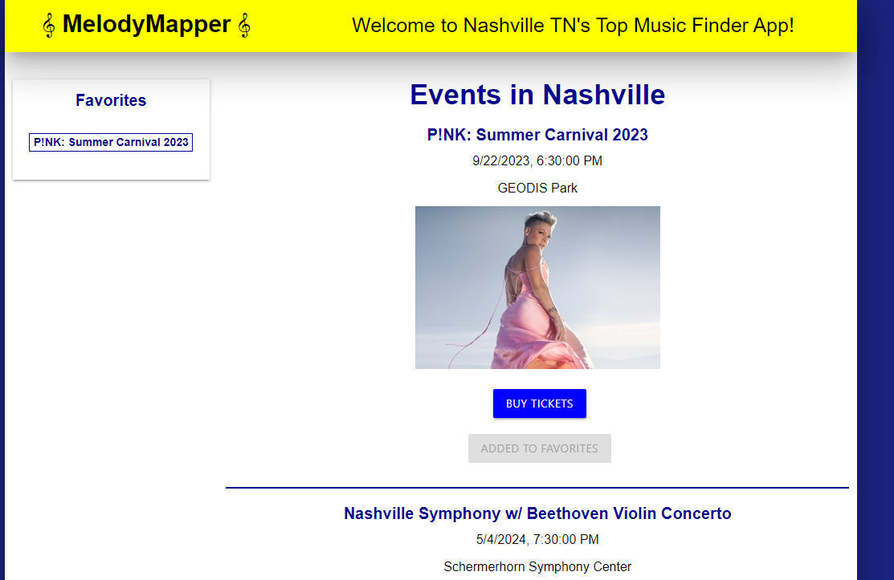

# MelodyMapper

## Description

Created a live music application that can serach concerts in the Nashville area. Users can search by band name, date, and even add specific concerts/live music to favorites section
saving to local storage.

## User Story

As a user,
I want to search live music,
so that I can easily find venues.

## Features

-- Use of 2 APIs (Ticketmaster & Real-Time Events Search) to bring extensive listing of live Nashville music
-- Sorting based on upcoming time/ date
-- Favorites list using local storage
-- Anchor tags in favorited items allowing you to easily locate them on the page
-- Links to sites offering purchase of event tickets

## Potential features

-- Interactive map displying locations of venues with upcoming music schuduled
-- color coded map points (red - standard) and (green-favorites)

## Acceptance Criteria (Requirements will change soon)

Needs 2 server side APIs

Must use CSS Framework other than Bootstrap (Looking at Tailwind)

Must use client side storage to store persistent data

Must have polished UI

Must meet good quality coding standards

Must NOT use alerts, confirms, or prompts (look at modal windows)

Must be deployed to GitHub Pages

Must be interactive (ie: accept and respond to user input)

## Installation

Download the files from the repo and install on domain. Should work instantly.

## Usage

This is a responsive website that presents a user with Events/Concerts in Nashville, TN. The user may buy tickets or add the band to the favorites so they may come back later and have quick access in order to buy tickets.

Link to view: [Melody Mapper](https://pgold762.github.io/MelodyMapper/)

Screenshot of website:

## Credits

https://materializecss.com/

Used the following to assist with responsive fonts: [Stackoverflow](https://stackoverflow.com/questions/49036519/how-to-make-font-sizes-responsive-in-materialize)

https://stackoverflow.com/questions/10123953/how-to-sort-an-object-array-by-date-property

Ticketmaster - https://developer.ticketmaster.com/products-and-docs/apis/getting-started/?ref=apilist.fun
-- can search events, venues, locations
-- free up to 5,000 requests a day
-- Get request indentifiers https://developer.ticketmaster.com/products-and-docs/apis/discovery-api/v2/#event-details-v2

Lucas- Tutoring with Meg Meyers

AskBCS

Received help from John (Teacher) on an error we received about an anchor

Received help from Anthony (TA) on setting up the sort by date feature

Received help from Anthony on initial setup of Favorites

Received help from a friend LeBraun (Sr Programmer) on setting up the Promise and MockAPI Data
